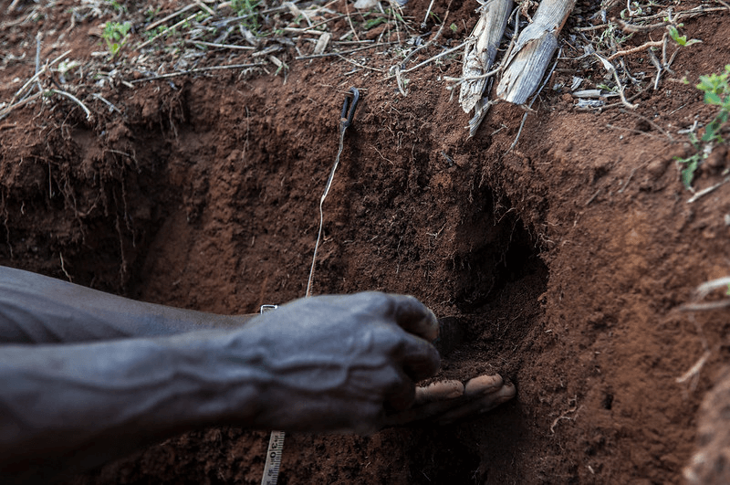
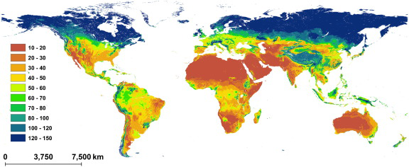
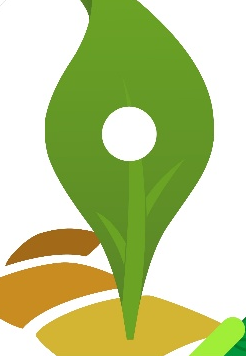
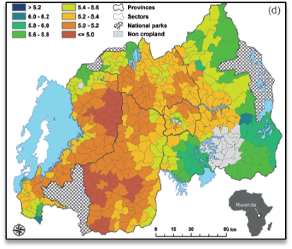
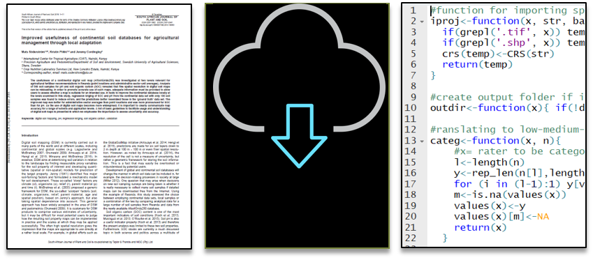
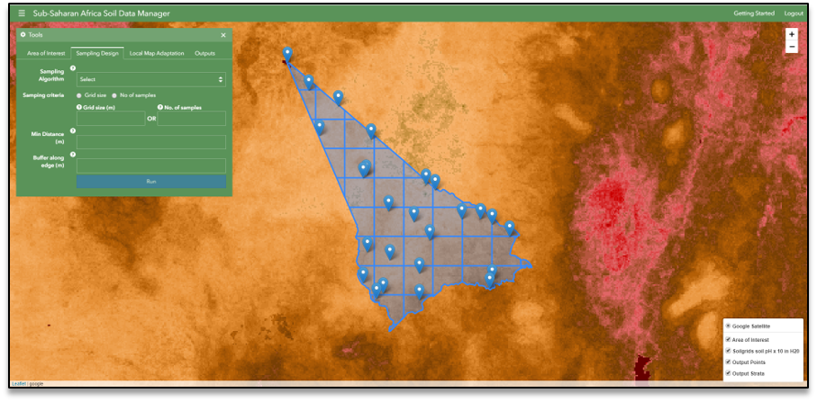
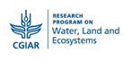
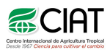
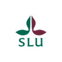

# Background

.pull-left[

- Visualizing soil data is exciting to many actors in agriculture and land use planning.

- Previously, one would have to travel to the field to collect soil samples and send them to the lab for analysis

]

--

.pull-right[

]

--

- But, recently, several global digital soil maps have been developed and published.

---

# Global digital soil maps

- Digital maps save the time (travel, carry soils samples to the lab and wait for results) before making crucial site-specific decisions.

.center[

]
--

- These maps are useful in guiding actors in the agricultural sector in making decisions at a country level.

--

- Howwever, they may not be useful guiding farmers in small areas or specific locations e.g. watershed area

---

# Site-specific agriculture

.pull-left[

- Site-specific crop management is the fundamental basis for sustainable intensification of crop production.

- For efficient agronomic inputs application, decisions related to types and rates of these inputs, should be based on local conditions.

- Else products may be applied –and wasted– where they are not needed

]

.pull-right[

]

---

# Local soil maps

- It is important to evaluate global soil maps before use and if needed improve the accuracy by using local soil data. 

.center[

]
- Availability

--

- Spatial resolution

--

- Accuracy

---

# Translating science to practice

There are two options here...

.pull-left[

Alt 1

1. Read article;

1. Download data;

1. Install software;

1. Carry out the analyses;

Difficulty : `****`

]

--

.pull-right[

Alt 2

1. Use SSA - SDM `*`;

Difficulty : `**`

.footnote[[*] Not convinced? See next slide.]

]

---

# Sub-Saharan Africa Soil Data Manager (SSA-SDM) <http://gsdm.ciat.cgiar.org>

- A tool for translating food security policies into practice;

- Provides open data as decision support for site-specific management decisions;

- Built using Free and open-source software (FOSS).

.center[

]

---

# System availability

- Countries;

- Counties;

- Villages;

- Fields;

- SSA region.

---

# Local use

- Fertilizer companies wishing to supply the right fertilizer blend to local needs (which depends on soil types/properties); 

--

- Authorities for designing programmes for sustainable intensification, such as subsidies of lime in areas with low pH; 

--

- Extension officers who want to generate risk maps of nutrient deficiencies in districts or regions; 

--

- Individual farmers or groups of farmers who want to make well founded decisions on input investments. 

---

# Key takeaways

--

- Diversify your communication

  - Scientific articles are suitable for scientists but a SSA-SDM may be better to reach practitioners;

--

- A web / smartphone tool can have added benefits 

  - SSA-SDM can be used as a collaboration platform and spark new collaborations and projects.

---

# How can you contribute

- Use the application <http://gsdm.ciat.cgiar.org/>

--

- Report use cases through  <mailto:ciat-gsdm@cgiar.org>

--

- File issues/ report a bug

--

- Feature requests

--

- Pull request

---

# Funding Sources

.column[

]

- Formas/SIDA (contract: 220-2013-1975);

- Federal Ministry for Economic Cooperation and Development (BMZ; contract: 81206681);

- Västra Götaland Region;

- Swedish University of Agricultural Sciences (contract: RUN 2018-00141). 

It formed part of the CGIAR Research Program on Water, Land and Ecosystems (WLE).

---

class: dv, center, middle

# Thank you!

---

class: dv, center, middle

# Questions?